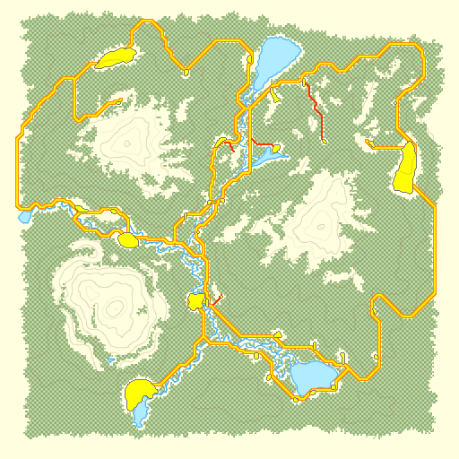
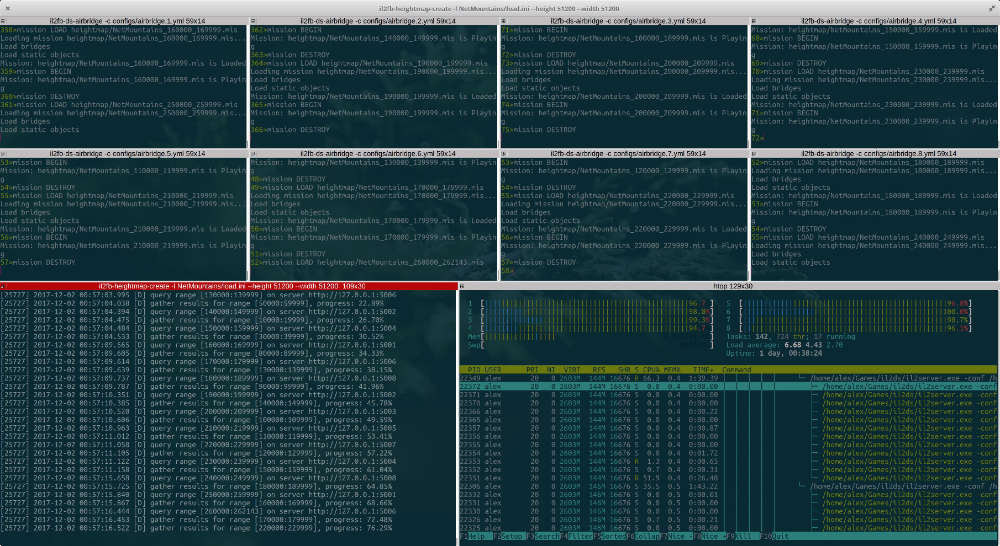
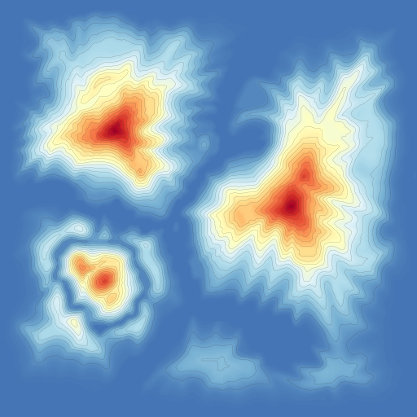

IL-2 FB Heightmap Creator
#########################

|pypi_package| |python_versions| |license|

**Table of Contents**

.. contents::
    :local:
    :depth: 3
    :backlinks: none

Synopsis
========

Heightmap Creator is an unitily which creates high-resolution heightmaps
of locations of «IL-2 Sturmovik» aviasimulator.

Height maps are created by loading missions to dedicated server. Missions
contain meshes of objects with a spacing of 100 meters between objects. After
a mission is loaded to server, coordinated of objects in the mission are
queried.

There is a limitation on max number of objects which can be placed in a single
mission and this limit is around 10'000 objects. Taking into consideration that
locations can have areas of thousands of square kilometers, it is not possible
to place all needed objects in a single mission. Hence, multiple missions are
genereated to query all heights sequentially. Heightmap Creator can use
multiple servers to parallelize all load to decrease overall execution time.
For example, it's possible to decrease execution time from hours to tens of
minutes.

The output of Heightmap Creator is a binary array of heights which are evenly
spaced over the whole location with a step of 100 meters.

Such binary data can be used to render height maps (including isohypses) or to
locate plains suitable for placing different objects on them, etc.

Heightmap Creator comes with a rendering tool which can visualize height maps
using colors which are comfortable for perception by humans.

Dependencies
============

Heightmap Creator communicated with IL-2 dedicated servers via HTTP API
provided by `il2fb-ds-airbridge <https://github.com/IL2HorusTeam/il2fb-ds-airbridge>`_,
so servers must run under its control.

Installation
============

Heightmap Creator is available as a Python package and can be installed via
``pip``:

.. code-block:: bash

    pip install il2fb-heightmap-creator

Available tools
===============

``il2fb-heightmap-creator`` package comes with a couple of tools for creation
of height maps.

``il2fb-heightmap-create``
--------------------------

Generates binary array of heights by querying points on a given location.

.. code-block::

    usage: il2fb-heightmap-create [-h] -l LOADER --height HEIGHT --width WIDTH
                                  [-o OUTPUT_FILE_PATH] -s SERVER_ADDRESSES
                                  [SERVER_ADDRESSES ...]

    Create heightmap for a given location of «IL-2 Sturmovik: Forgotten Battles»

    optional arguments:
      -h, --help            show this help message and exit
      -l LOADER, --loader LOADER
                            Map loader, e.g. 'Hawaii/load.ini'
      --height HEIGHT       Map height in meters. Must be proportional to 100
      --width WIDTH         Map width in meters. Must be proportional to 100
      -o OUTPUT_FILE_PATH, --out OUTPUT_FILE_PATH
                            Output file path. Default: 'heightmap.raw'
      -s SERVER_ADDRESSES [SERVER_ADDRESSES ...], --servers SERVER_ADDRESSES [SERVER_ADDRESSES ...]
                            Addesses of root HTTP API endpoints of dedicated
                            servers controlled by «il2fb-ds-airbridge»

``il2fb-heightmap-render``
--------------------------

Renders binary data generated by Heightmap Creator.

.. code-block::

    usage: il2fb-heightmap-render [-h] --height HEIGHT --width WIDTH
                                  [-i INPUT_FILE_PATH] [-o OUTPUT_FILE_PATH]
                                  [--isostep ISOSTEP] [-r DPI]

    Render heightmap of a given location of «IL-2 Sturmovik: Forgotten Battles»

    optional arguments:
      -h, --help            show this help message and exit
      --height HEIGHT       Map height in meters. Must be proportional to 100
      --width WIDTH         Map width in meters. Must be proportional to 100
      -i INPUT_FILE_PATH, --in INPUT_FILE_PATH
                            Input file path. Default: 'heightmap.raw'
      -o OUTPUT_FILE_PATH, --out OUTPUT_FILE_PATH
                            Output file path. Default: 'heightmap.png'
      --isostep ISOSTEP     Step in meters between isohypses. Default: 200
      -r DPI, --dpi DPI     Output resolution in DPI. Default: 48

Example of usage
================

Here is an example of heightmap creation process for ``NetMountains`` location.

That location has size of 51.2 × 51.2 km and its map is shown below.

At least one dedicated server under control of Airbridge is needed to create a
heightmap. For this example we will use 8 servers. In this case binary
heightmap can be obtained be running the following command:

.. code-block:: bash

    il2fb-heightmap-create -l NetMountains/load.ini --height 51200 --width 51200 -o heightmap.raw -s \
        http://127.0.0.1:5001 \
        http://127.0.0.1:5002 \
        http://127.0.0.1:5003 \
        http://127.0.0.1:5004 \
        http://127.0.0.1:5005 \
        http://127.0.0.1:5006 \
        http://127.0.0.1:5007 \
        http://127.0.0.1:5008

Creation of heightmap will look as it is shown on the image below.
`Watch this video <https://youtu.be/eNNApVyr_Tk>`_ to see the whole process.

Heightmap Creator will produce a binary array stored in ``heightmap.raw`` file.
This file can be used to render a 2D heightmap using ``il2fb-heightmap-render``
tool:

.. code-block:: bash

    il2fb-heightmap-render --height 51200 --width 51200 -i heightmap.raw -o heightmap.png

This will produce a ``heightmap.png`` image which is shown below.

.. |pypi_package| image:: http://img.shields.io/pypi/v/il2fb-heightmap-creator.svg?style=flat
   :target: https://pypi.python.org/pypi?name=il2fb-heightmap-creator&:action=display

.. |python_versions| image:: https://img.shields.io/badge/Python-3.6-brightgreen.svg?style=flat
   :alt: Supported versions of Python

.. |license| image:: https://img.shields.io/badge/license-MIT-blue.svg?style=flat
   :target: https://github.com/IL2HorusTeam/il2fb-heightmap-creator/blob/master/LICENSE
   :alt: MIT license
